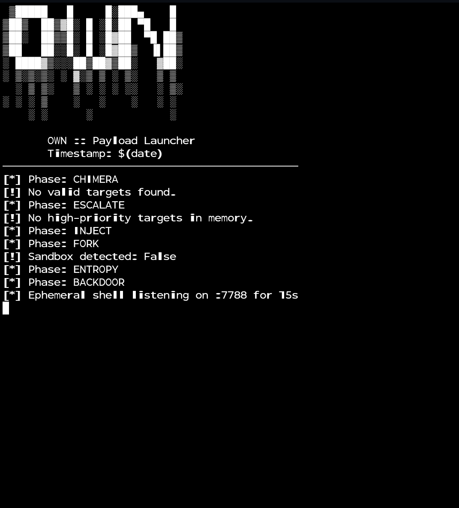

# OWN

Payload and automation suite focused on exfiltration and post-exploitation persistence.

---

## Features
- Automated payload launching
- Persistence mechanisms
- Network exfiltration modules

---

## Installation

Clone the repo and install dependencies (adjust as needed):

    git clone https://github.com/GnomeMan4201/OWN.git
    cd OWN
    # Follow further instructions or run setup script here

---

## Usage

Run the payload launcher script and monitor outputs.

---

## Assets Preview

---

## Logo

---

## Legal Disclaimer

These tools are intended strictly for authorized research, security testing, and educational purposes. Unauthorized use is prohibited. You are responsible for compliance with all applicable laws and regulations.
